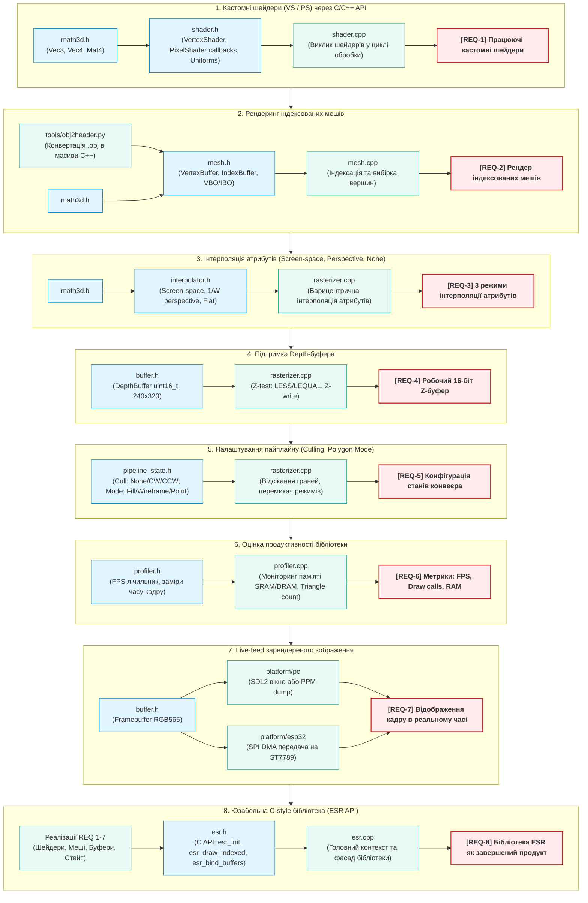

```mermaid
flowchart TD
    classDef req fill:#ffebee,stroke:#c62828,stroke-width:2px,font-weight:bold;
    classDef header fill:#e1f5fe,stroke:#0288d1,stroke-width:1px;
    classDef impl fill:#e8f8f5,stroke:#26a69a,stroke-width:1px;

    %% 1. Кастомні шейдери
    subgraph S1["1. Кастомні шейдери (VS / PS) через C/C++ API"]
        D1_Math["math3d.h<br/>(Vec3, Vec4, Mat4)"]:::header --> D1_Shader["shader.h<br/>(VertexShader, PixelShader callbacks, Uniforms)"]:::header
        D1_Shader --> I1_Shader["shader.cpp<br/>(Виклик шейдерів у циклі обробки)"]:::impl
        I1_Shader --> R1["[REQ-1] Працюючі кастомні шейдери"]:::req
    end

    %% 2. Індексовані меші
    subgraph S2["2. Рендеринг індексованих мешів"]
        D2_Obj["tools/obj2header.py<br/>(Конвертація .obj в масиви C++)"]:::impl --> D2_Mesh["mesh.h<br/>(VertexBuffer, IndexBuffer, VBO/IBO)"]:::header
        D2_Math["math3d.h"]:::header --> D2_Mesh
        D2_Mesh --> I2_Mesh["mesh.cpp<br/>(Індексація та вибірка вершин)"]:::impl
        I2_Mesh --> R2["[REQ-2] Рендер індексованих мешів"]:::req
    end

    %% 3. Інтерполяція атрибутів
    subgraph S3["3. Інтерполяція атрибутів (Screen-space, Perspective, None)"]
        D3_Math["math3d.h"]:::header --> D3_Interp["interpolator.h<br/>(Screen-space, 1/W perspective, Flat)"]:::header
        D3_Interp --> I3_Rast["rasterizer.cpp<br/>(Барицентрична інтерполяція атрибутів)"]:::impl
        I3_Rast --> R3["[REQ-3] 3 режими інтерполяції атрибутів"]:::req
    end

    %% 4. Depth-буфер
    subgraph S4["4. Підтримка Depth-буфера"]
        D4_Buf["buffer.h<br/>(DepthBuffer uint16_t, 240x320)"]:::header --> I4_Rast["rasterizer.cpp<br/>(Z-test: LESS/LEQUAL, Z-write)"]:::impl
        I4_Rast --> R4["[REQ-4] Робочий 16-біт Z-буфер"]:::req
    end

    %% 5. Налаштування пайплайну
    subgraph S5["5. Налаштування пайплайну (Culling, Polygon Mode)"]
        D5_State["pipeline_state.h<br/>(Cull: None/CW/CCW; Mode: Fill/Wireframe/Point)"]:::header --> I5_Rast["rasterizer.cpp<br/>(Відсікання граней, перемикач режимів)"]:::impl
        I5_Rast --> R5["[REQ-5] Конфігурація станів конвеєра"]:::req
    end

    %% 6. Продуктивність та метрики
    subgraph S6["6. Оцінка продуктивності бібліотеки"]
        D6_Prof["profiler.h<br/>(FPS лічильник, заміри часу кадру)"]:::header --> I6_Prof["profiler.cpp<br/>(Моніторинг пам'яті SRAM/DRAM, Triangle count)"]:::impl
        I6_Prof --> R6["[REQ-6] Метрики: FPS, Draw calls, RAM"]:::req
    end

    %% 7. Live-feed вивід
    subgraph S7["7. Live-feed зарендереного зображення"]
        D7_Buf["buffer.h<br/>(Framebuffer RGB565)"]:::header --> I7_PC["platform/pc<br/>(SDL2 вікно або PPM dump)"]:::impl
        D7_Buf --> I7_ESP["platform/esp32<br/>(SPI DMA передача на ST7789)"]:::impl
        I7_PC --> R7["[REQ-7] Відображення кадру в реальному часі"]:::req
        I7_ESP --> R7
    end

    %% 8. Готове C-style API (ESR)
    subgraph S8["8. Юзабельна C-style бібліотека (ESR API)"]
        D8_All["Реалізації REQ 1-7<br/>(Шейдери, Меші, Буфери, Стейт)"]:::impl --> D8_API["esr.h<br/>(C API: esr_init, esr_draw_indexed, esr_bind_buffers)"]:::header
        D8_API --> I8_API["esr.cpp<br/>(Головний контекст та фасад бібліотеки)"]:::impl
        I8_API --> R8["[REQ-8] Бібліотека ESR як завершений продукт"]:::req
    end

    %% Послідовність між блоками
    S1 --> S2 --> S3 --> S4 --> S5 --> S6 --> S7 --> S8
```
